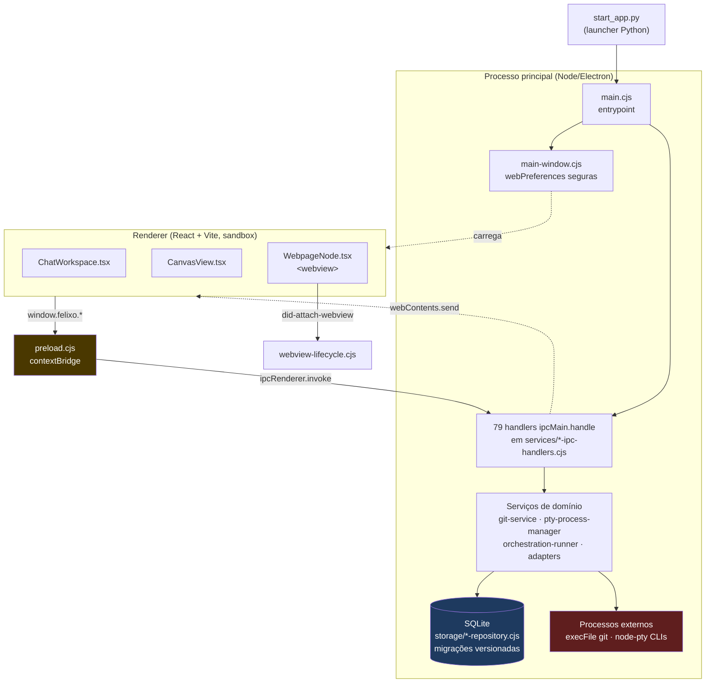

# Auditoria de Código e Segurança — Felixo AI Core

> **Data**: 08/08/2026 · **Escopo**: repositório inteiro (código de produção)
> **Método**: leitura direta do código. Toda afirmação aqui está ancorada em `arquivo:linha`.
> **Commit base**: `2b92f75`

---

## 1. Sumário executivo

O projeto está em estado **melhor do que a premissa da auditoria supunha**. A expectativa era encontrar
um sistema construído em blocos desconexos, com duplicação ampla e falhas de segurança; o que existe é
um backend Electron com fronteiras razoavelmente respeitadas, SQL 100% parametrizado, execução de
processos sem shell na maior parte dos casos, e nenhuma dependência com CVE conhecido (`npm audit`: 0).
Não foi encontrado segredo em código, nem SQL injection, nem `catch` vazio, nem promise flutuante.

Os três problemas estruturais reais são: (1) **funções e componentes "faz-tudo"** — `sendCliRequest`
tem ~570 linhas aninhadas dentro de uma função de ~790 (`ipc-handlers.cjs:82-871`), e `CanvasView.tsx`
concentra 54 hooks em 1611 linhas; (2) **duplicação de utilitário trivial** — `toErrorResult` está
copiado byte a byte em 9 arquivos; (3) **colisão de nome com semânticas divergentes** —
`normalizePositiveInteger` existe 2x no mesmo processo com contratos de erro opostos.

O maior risco de segurança é **SEC-01**: o `.env` não está no `.gitignore` embora o `.env.example`
instrua explicitamente a criá-lo. Nada vazou até hoje (histórico verificado, limpo), e as variáveis
documentadas hoje não são segredos — por isso é Média, não Crítica. Mas é uma armadilha armada: o dia
em que alguém colocar um `GH_TOKEN` ali, o commit passa sem resistência.

---

## 2. Mapa de arquitetura

### Módulos de topo

| Módulo | Responsabilidade | Entrada |
|---|---|---|
| `start_app.py` + `felixo_launcher/` | Menu interativo cross-platform: instala deps, resolve Node, sobe o app | `python start_app.py` |
| `app/electron/` | Processo principal: IPC, spawn de CLIs/PTY, SQLite, janelas | `electron/main.cjs` |
| `app/electron/services/` | 53 arquivos: um serviço por responsabilidade (IPC handlers, adapters, orquestração) | — |
| `app/electron/services/storage/` | Repositórios SQLite + migrações versionadas | `sqlite-database.cjs` |
| `app/src/features/chat/` | UI de chat, orquestração de modelos, storages de migração | `ChatWorkspace.tsx` |
| `app/src/features/canvas/` | Canvas React Flow: blocos de terminal/nota/arquivo/grupo/página web | `CanvasView.tsx` |
| `app/electron/preload.cjs` | Única ponte renderer↔main (`contextBridge`, 189 linhas) | — |

### Fluxo e fronteiras



**A fronteira principal está bem desenhada**: o renderer não tem acesso a Node
(`window-options.cjs:16-18` — `contextIsolation: true`, `nodeIntegration: false`, `sandbox: true`),
e tudo passa pelo `preload.cjs`. A camada de storage é isolada em repositórios; nenhum SQL vaza
para a UI.

**Onde a fronteira está furada**: `ipc-handlers.cjs` mistura registro de IPC, regra de orquestração,
normalização de entrada e formatação de evento no mesmo arquivo (ver ARQ-01).

---

## 3. Achados

| ID | Severidade | Confiança | Área | Resumo | Status |
|---|---|---|---|---|---|
| SEC-01 | Média | Confirmado | Config | `.env` não ignorado, com `.env.example` mandando criá-lo | ✅ Corrigido |
| SEC-02 | Baixa | Confirmado | Electron | Popup do webview não restringe suas próprias novas janelas | ✅ Corrigido |
| PRIV-01 | Média | Confirmado | Dados | Títulos de conversa pessoais versionados em repo open source | ⚠️ Parcial — removido do `HEAD`, segue no histórico |
| ARQ-01 | Alta | Confirmado | Backend | `sendCliRequest`: ~570 linhas dentro de função de ~790 | ⏸️ Aberto (Fase 2) |
| ARQ-02 | Média | Confirmado | Frontend | `CanvasView.tsx`: 1611 linhas, 54 hooks, 37 imports | ⏸️ Aberto (Fase 2) |
| DUP-01 | Média | Confirmado | Backend | `toErrorResult` idêntico em 9 arquivos | ✅ Corrigido |
| DUP-02 | Baixa | Confirmado | Backend | `normalizePositiveInteger` 2x com semânticas opostas | ✅ Corrigido |
| DEAD-01 | Baixa | Confirmado | Frontend | 3 exports sem nenhum uso | ✅ Corrigido |

> **Correções aplicadas nesta sessão** — Fases 0 e 1 completas:
> - `ce878a1` — SEC-01 + PRIV-01 (`.gitignore` e remoção de `recentItems`)
> - `e8518d9` — SEC-02 (política recursiva de novas janelas + 3 testes)
> - `8c2e7d3` — DUP-01, DUP-02, DEAD-01 (consolidação, sem mudança de comportamento)
>
> A Fase 2 (ARQ-01, ARQ-02) permanece **aberta por decisão explícita** — são as duas mudanças
> capazes de quebrar comportamento silenciosamente e nenhuma tem hoje rede de testes que pegue a
> regressão. Validação após as correções: `tsc -b` limpo, **428/428 testes passando**.

---

### SEC-01 — `.env` fora do `.gitignore`

- **Severidade**: Média · **Confiança**: Confirmado
- **Local**: `.gitignore:1-6` · `.env.example:3` · `app/.gitignore:13`
- **Problema**: o `.env.example:3` instrui "Copie este arquivo para `.env`", mas nenhum `.gitignore`
  cobre `.env`.
- **Verificação executada**:
  ```
  .env             -> NAO IGNORADO
  app/.env         -> NAO IGNORADO
  .env.local       -> NAO IGNORADO
  app/.env.local   -> IGNORADO   (acidental, via `*.local` em app/.gitignore:13)
  ```
  Histórico verificado com `git log --all --diff-filter=A`: `.env` **nunca** foi commitado.
- **Cenário de falha**: o usuário segue a instrução do `.env.example`, cria `.env`, e mais tarde
  adiciona um `GH_TOKEN` (usado por `npm run publish:github`, ver `docs/_legado/projeto/DISTRIBUICAO-E-ATUALIZACOES.md:69`).
  Um `git add -A` — usado rotineiramente neste repo — comita o token para um repositório público.
- **Por que não é Crítica**: as variáveis hoje documentadas em `.env.example` são caminhos e flags
  (`FELIXO_CLI_PATHS`, `FELIXO_SHELL`, `FELIXO_NODE_BIN`…), não segredos; e o CI usa
  `secrets.GITHUB_TOKEN` com `permissions: contents: write` (`.github/workflows/release.yml:8-9,32`),
  sem depender de `.env`.
- **Correção proposta** (menor diff): acrescentar ao `.gitignore` da raiz:
  ```
  .env
  .env.*
  !.env.example
  ```

---

### SEC-02 — Popup do webview não restringe novas janelas em cascata

- **Severidade**: Baixa · **Confiança**: Confirmado
- **Local**: `app/electron/services/webview-lifecycle.cjs:35-45`
- **Problema**: quando um `window.open()` dentro do bloco de Página Web é permitido, a janela filha
  recebe `webPreferences` seguras, mas **não** recebe um `setWindowOpenHandler` próprio.
- **Cenário de falha**: usuário abre um site hostil no bloco → o site abre um popup (permitido, é o
  fluxo de login) → esse popup chama `window.open()` repetidamente e cada chamada cria uma
  `BrowserWindow` sem qualquer política, até esgotar a janela do usuário. Comparação: a janela
  principal está protegida (`main-window.cjs:10` → `denyExternalWindowOpen`), o popup não.
- **Nota de honestidade**: esta é uma lacuna do código que **eu mesmo escrevi** nesta sessão
  (commits `e68d09f`/`2b92f75`). Não é herdada.
- **Correção proposta**: no `did-attach-webview`, após permitir, aplicar o mesmo handler ao
  `webContents` da janela criada — via o evento `did-create-window` do guest — ou usar
  `createWindow` para instanciar a `BrowserWindow` já com handler registrado.

---

### PRIV-01 — Dados pessoais em mock versionado

- **Severidade**: Média · **Confiança**: Confirmado
- **Local**: `app/src/features/chat/data/models.ts:58-71` (no commit auditado)
- **Problema**: `recentItems` era um array de 12 títulos de conversas reais, versionado num
  repositório público. Vários tratavam de assuntos pessoais — situação financeira, vida acadêmica e
  consumo pessoal. Os valores não são reproduzidos aqui: um relatório de segurança não deve
  recopiar o dado que aponta como exposto, ainda mais estando ele mesmo versionado.
- **Cenário de falha**: já materializado — o dado ficou público por ~3,5 meses (desde `aee9b50`,
  28/04/2026), em `main` e `production`, e chegou a existir em 10 arquivos de
  `app/src/features/chat/` ao longo do histórico, não só em `models.ts`.
- **Agravante**: o export era **código morto** (ver DEAD-01) — `ChatWorkspace.tsx:3-7` importa
  apenas `initialModels`, `ideaStarters` e `quickPrompts`. O dado não servia a nada.
- **Correção aplicada**: removido do `HEAD` (`ce878a1`) e, por decisão do dono do projeto,
  **expurgado do histórico** com `git filter-repo --replace-text`, substituindo cada título por um
  rótulo genérico em todos os commits e arquivos onde apareceu. Ver seção 7 para o procedimento e
  as limitações do expurgo.

---

### ARQ-01 — `sendCliRequest`: função de ~570 linhas dentro de outra de ~790

- **Severidade**: Alta · **Confiança**: Confirmado
- **Local**: `app/electron/services/ipc-handlers.cjs:82-871` (`registerCliIpcHandlers`),
  com `sendCliRequest` em `:158-727` (linhas 77→646 relativas)
- **Problema**: um único closure concentra registro de IPC, ciclo de vida de sessão, política de
  orquestração, normalização de entrada e emissão de eventos. O arquivo tem 1177 linhas.
- **Cenário de falha**: não é um bug hoje — é custo de mudança. Qualquer alteração no fluxo de envio
  exige entender ~570 linhas de estado compartilhado por closure, sem ponto de teste isolado: a
  função não é exportada, então só é testável através do IPC inteiro.
- **Evidência de contraste**: o mesmo repositório tem o padrão certo em `git-service.cjs`, onde a
  lógica pura (`assertAllowedGitArgs`, `normalizeCommitMessage`) é exportada e testada isoladamente.
- **Correção proposta**: extrair de `sendCliRequest` os blocos puros (normalização de modelos,
  decisão de limites de orquestração) para um módulo `cli-request-policy.cjs` exportado e testável,
  mantendo no handler apenas a orquestração de efeitos. Refatoração incremental, não reescrita.

---

### ARQ-02 — `CanvasView.tsx` como componente "faz-tudo"

- **Severidade**: Média · **Confiança**: Confirmado
- **Local**: `app/src/features/canvas/components/CanvasView.tsx` (1611 linhas, 54 hooks, 37 imports)
- **Problema**: concentra estado do canvas, persistência, orquestração de terminais, edges, grupos,
  notificações e a injeção de handlers por tipo de node (`:811-900`).
- **Cenário de falha**: custo de mudança e risco de regressão por re-render. Relevante especialmente
  no hardware alvo (notebook modesto) — cada mudança de `nodes` recalcula o `useMemo` de 90 linhas
  em `:811-900`, que já precisou de um cache manual (`reuseData`) para não recriar `data` de todo
  node a cada render.
- **Correção proposta**: extrair a injeção de handlers por tipo (`:811-900`) para um hook próprio
  (`useRenderedNodes`), que é a fatia mais autocontida e a que mais cresce quando um novo tipo de
  bloco é adicionado.

---

### DUP-01 — `toErrorResult` copiado em 9 arquivos

- **Severidade**: Média · **Confiança**: Confirmado
- **Local** (todos idênticos, hash `02b8e840fec13e87092c54577b133bea`):
  `notes-ipc-handlers.cjs:43` · `models-ipc-handlers.cjs:36` · `system-design-ipc-handlers.cjs:177` ·
  `pty-ipc-handlers.cjs:104` · `canvas-ipc-handlers.cjs:268` · `projects-ipc-handlers.cjs:293` ·
  `automations-ipc-handlers.cjs:36` · `canvas-files-ipc-handlers.cjs:212` ·
  `chat-history-ipc-handlers.cjs:56`
- **Problema**: o helper que padroniza a resposta de erro de **todo** IPC está duplicado 9 vezes.
- **Cenário de falha**: o contrato de erro do app é definido em 9 lugares. Mudar o formato (ex.:
  incluir um `code`) exige 9 edições coordenadas; esquecer uma cria divergência silenciosa de
  contrato entre canais IPC — exatamente o tipo de inconsistência que o
  `DESIGN_SYSTEM_BACKEND.md` §2.3 ("contratos previsíveis") existe para evitar.
- **Correção proposta**: extrair para `electron/services/ipc-result.cjs` e importar nos 9.
  Baixo risco: função pura, sem estado, com assinatura idêntica em todos os pontos.

---

### DUP-02 — `normalizePositiveInteger` com duas semânticas no mesmo processo

- **Severidade**: Baixa · **Confiança**: Confirmado
- **Local**: `electron/services/orchestration/orchestration-store.cjs:387` e
  `electron/services/ipc-handlers.cjs:1126` (+ uma terceira em
  `src/features/chat/services/orchestrator-settings-storage.ts:493`, aceitável por ser outra camada)
- **Problema**: mesmo nome, contratos **opostos** em caso de valor inválido:
  - `orchestration-store.cjs:392` → **lança** `OrchestrationStoreError`
  - `ipc-handlers.cjs:1127` → **retorna** `undefined`
- **Cenário de falha**: quem lê `normalizePositiveInteger(x)` em `ipc-handlers.cjs` e assume o
  comportamento da outra (ou vice-versa) escreve tratamento de erro errado — um `try/catch` que nunca
  dispara, ou um `if (!value)` que nunca protege.
- **Correção proposta**: renomear conforme o contrato — `requirePositiveInteger` (lança) e
  `toPositiveIntegerOrUndefined` (retorna). Não unificar: as duas semânticas são legítimas nos seus
  contextos; o problema é o nome compartilhado.

---

### DEAD-01 — Exports sem nenhum uso

- **Severidade**: Baixa · **Confiança**: Confirmado (busca em `src/`, `electron/`, `tests/`)
- **Local**:
  - `src/features/chat/data/models.ts:58` — `recentItems` (ver PRIV-01)
  - `src/features/chat/hooks/useOrchestrationDashboard.ts:233` — `ORCHESTRATION_DASHBOARD_EMPTY`
  - `src/features/chat/services/model-storage.ts:164` — `normalizeCliType`
- **Verificação**: cada um tem exatamente **1 ocorrência** no repositório inteiro (a própria
  definição). Confirmado com `grep -rn` sobre `src/`, `electron/` e `tests/`.
- **Cenário de falha**: não quebra nada. Custo é de leitura — código morto sugere que existe um
  consumidor, e quem for mexer perde tempo procurando.
- **Correção proposta**: remover os três.

> **Falsos positivos descartados** (mantidos aqui para não serem reinvestigados): `DEFAULT_NOTE_COLOR`,
> `NOTE_THEMES`, `buildAgentIdentityPrompt`, `MAX_HANDOFF_TRANSCRIPT_CHARS` aparecem como "sem uso
> externo" mas **são usados dentro do próprio arquivo** — o `export` é dispensável, não morto.

---

## 3.1 Expurgo do histórico (PRIV-01) — procedimento e limitações

Executado a pedido do dono do projeto, depois de apresentado o custo/benefício.

**Procedimento**:
1. Backup espelho completo do repositório antes de qualquer escrita.
2. Correção do próprio relatório, que citava três dos títulos como evidência e os
   reintroduziria no `HEAD` (commit `e65df2b`, pré-expurgo).
3. `git filter-repo --replace-text`, substituindo cada um dos 12 títulos por um rótulo genérico
   (`Exemplo de conversa N`). Escolhido em vez de remover o arquivo: `models.ts` contém código
   legítimo que deve permanecer no histórico, e o dado havia passado por **10 arquivos** de
   `app/src/features/chat/` ao longo do tempo — remover só `models.ts` não teria bastado.
4. `--force-with-lease` em `main` e `production`, mais a tag `v0.1.1` (reescrita junto).

**Verificação**: busca por cada título em `git log --all -S` retorna zero ocorrências, tanto no
repositório local quanto em **clone fresco do GitHub**. A contagem de commits bate com o backup
(478 + 1 novo = 479), `git fsck` sem erros, `tsc -b` limpo e 428/428 testes passando. O diff entre
o histórico antigo e o novo é exatamente as 12 linhas — nenhum outro conteúdo mudou.

**O que o expurgo NÃO resolveu** (limitação inerente, não falha de execução):
- O fork `flaviavs-commits/Felixo-AI-Core` mantém o histórico antigo com o dado original. Se a
  conta for do próprio dono, dá para limpar da mesma forma; se não for, o dado permanece fora
  do seu controle.
- Objetos órfãos podem persistir no cache do GitHub por tempo indeterminado. É possível pedir
  coleta de lixo ao suporte do GitHub caso o dado seja sensível o bastante para justificar.
- Clones locais feitos antes desta data seguem com o histórico antigo.

---

## 4. Plano de remediação

### Fase 0 — Parar o sangramento ✅ concluída

| Item | Esforço | Risco de regressão | Como foi validado |
|---|---|---|---|
| SEC-01 — `.env` no `.gitignore` | P | Nenhum | `git check-ignore` confirma `.env`, `app/.env`, `.env.*` ignorados e `.env.example` preservado |
| PRIV-01 — remover `recentItems` do `HEAD` | P | Nenhum (era morto) | `tsc -b` limpo; `ChatWorkspace.tsx:3-7` importa só os 3 exports restantes |
| PRIV-01 — expurgar do histórico | M | Nenhum no código; quebra clones/fork | Ver seção 3.1: verificado em clone fresco do remoto |

### Fase 1 — Consolidação barata ✅ concluída

| Item | Esforço | Risco de regressão | Como foi validado |
|---|---|---|---|
| DEAD-01 — remover 3 exports mortos | P | Nenhum | `tsc -b` limpo (acusaria qualquer uso que o grep perdesse) |
| DUP-01 — extrair `toErrorResult` | P | Baixo | Novo `electron/services/ipc-result.cjs`; 9 arquivos passam a importar. Teste existente em `pty-ipc-handlers.test.cjs:82` agora exercita a implementação única |
| SEC-02 — política recursiva de janelas | P | Baixo | 3 testes novos em `webview-lifecycle.test.cjs` cobrindo deny in-place, allow sem navegar o opener, e herança pelo popup |
| DUP-02 — renomear por contrato | P | Baixo | `requirePositiveInteger` (lança) vs `toPositiveIntegerOrUndefined` (retorna); ambas privadas, sem consumidor externo |

### Fase 2 — Refatoração estrutural

| Item | Esforço | Risco de regressão | O que testar antes |
|---|---|---|---|
| ARQ-01 — extrair política de `sendCliRequest` | G | **Alto** | Precisa de teste de caracterização do fluxo `cli:send` **antes** de mover qualquer linha |
| ARQ-02 — extrair `useRenderedNodes` | M | Médio | Teste manual dos 5 tipos de bloco + persistência entre restarts |

> Fase 2 não deve ser feita sem acompanhamento. São as únicas mudanças da lista capazes de quebrar
> comportamento silenciosamente, e nenhuma das duas tem hoje rede de testes que pegue a regressão.

---

## 5. Perguntas em aberto

Todas as três perguntas originais foram respondidas pelo dono do projeto. Registradas aqui com o
desfecho, e o que sobrou de cada uma:

1. ~~**PRIV-01 / histórico**~~ → **Resolvido**: expurgo autorizado e executado (seção 3.1). Sobrou
   uma ação fora do escopo desta auditoria: **limpar o fork `flaviavs-commits/Felixo-AI-Core`**,
   que mantém o histórico antigo. Se a conta for do próprio dono, o mesmo procedimento se aplica.
2. ~~**ARQ-01**~~ → **Resolvido**: refatoração autorizada, com exigência explícita de TDD.
3. ~~**`.env` na raiz vs `app/`**~~ → **A premissa da pergunta estava errada.** Investigando para
   responder, descobri que **nenhum processo carrega `.env`**: não há `dotenv` no Node nem
   `load_dotenv` no Python. O `.env.example` documentava um mecanismo inexistente — copiá-lo para
   `.env` não teria efeito nenhum. A configuração real é o menu do `start_app.py`, que grava
   `.felixo-start-config.json` (já gitignorado) e o aplica ao ambiente em
   `felixo_launcher/runner.py:92` via `apply_config_to_env`. O exemplo foi corrigido para apontar
   o caminho que funciona; o `.gitignore` mantém `.env` coberto como rede de segurança.

---

## 6. O que NÃO foi coberto

Em nome da honestidade sobre o alcance desta auditoria:

- **Testado por leitura, não por execução**: nenhum achado foi validado rodando o app. As
  verificações executadas foram `npm test` (425 passando), `tsc -b` (limpo), `npm audit` (0 vulns)
  e `git check-ignore`.
- **Cobertura rasa**: `felixo_launcher/` (2167 linhas Python) recebeu apenas varredura de segurança
  (sem `shell=True`, confirmado); sua lógica interna não foi auditada. `docs/_legado/` foi ignorado
  por ser documentação arquivada.
- **Não auditado**: `orchestration-runner.cjs` (1010 linhas) e `persistent-cli-session.cjs`
  (847 linhas) — são os dois maiores arquivos de lógica que restaram sem leitura linha a linha.
  São candidatos naturais a uma segunda passada.
- **Sem análise dinâmica**: não houve fuzzing de IPC, teste de penetração, nem verificação de
  comportamento em runtime.
